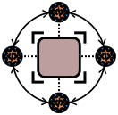

### SharsorIPCpp &nbsp;&nbsp;&nbsp;&nbsp;


Shared Tensors through Inter Process Communication on C++ for POSIX-compatible OS.

External dependencies: 
- **Eigen3**: a C++ template library for linear algebra. On Linux, install it with ```sudo apt-get install libeigen3-dev```.
- **GTest** (Google Test): a C++ testing framework. On Linux, install it with ```sudo apt-get install libgtest-dev```.
- Real-time library (**rt**). ```sudo apt-get install librt-dev```
- **pthread**: the POSIX Threads library. On Linux, install it with ```sudo apt-get install libpthread-stubs0-dev```